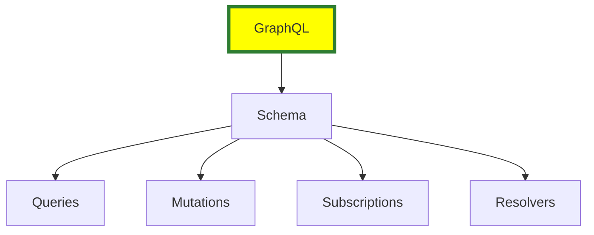
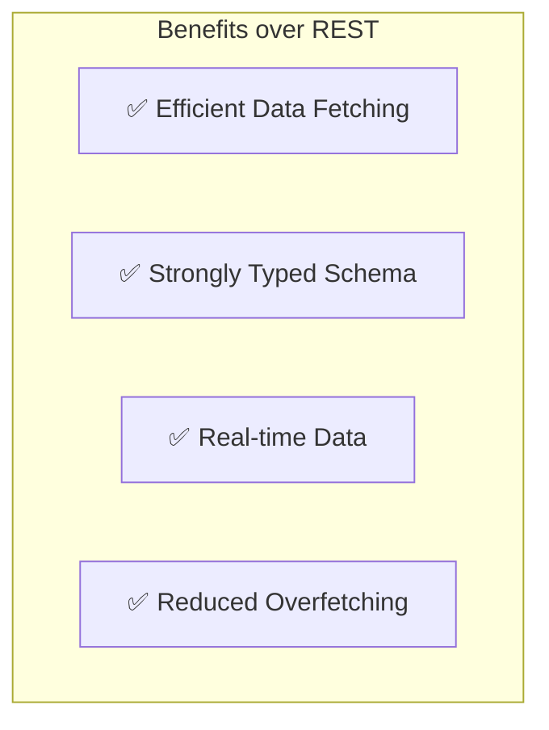

# graphql


# What is GraphQL?

**GraphQL** is a query language for APIs and a runtime for executing those queries with your existing data. It was developed by Facebook in 2012 and released as an open-source project in 2015.

## 🔍 Key Features

- **Declarative Data Fetching**: Clients specify exactly what data they need.
- **Single Endpoint**: Unlike REST, GraphQL APIs typically use a single endpoint.
- **Strongly Typed Schema**: The API is defined by a schema that specifies types and relationships.
- **Real-time Data**: Supports subscriptions for real-time updates.

## 🧱 Core Concepts

- **Schema**: Defines the structure of the API.
- **Types**: Describe the shape of data (e.g., `User`, `Post`).
- **Queries**: Read operations to fetch data.
- **Mutations**: Write operations to modify data.
- **Resolvers**: Functions that resolve a value for a type or field.
- **Subscriptions**: Enable real-time communication via WebSockets.

## 📦 Example Query

```graphql
query {
  user(id: "1") {
    name
    email
  }
}
```







## ✅ Efficient Data Fetching
- **Definition**: The ability to request exactly the data you need in a single query.
- **Focus**: Precision and performance.
- **Example**: Requesting just a user's `name` and `email` without retrieving their entire profile.
- **Why it Matters**: Reduces the number of requests and the size of responses, improving speed and reducing bandwidth usage.

---

## 📉 Reduced Overfetching
- **Definition**: Avoiding the retrieval of unnecessary data.
- **Focus**: Minimizing waste.
- **Example**: In REST, an endpoint like `/users/123` might return the full user object, including fields you don’t need (e.g., `address`, `preferences`, `lastLogin`).
- **Why it Matters**: Prevents clients from receiving and processing data they don’t use, which can slow down apps and waste resources.

---

## 🔒 Strongly Typed Schema
- **Definition**: GraphQL schemas are strongly typed, meaning each field has a specific type.
- **Focus**: Ensuring data consistency and validation.
- **Example**: A schema defines a `User` type with fields like `id`, `name`, and `email`, each with a defined type.
- **Why it Matters**: Helps catch errors early and ensures that clients and servers agree on the data format.

---

## 🔄 Real-time Data
- **Definition**: GraphQL supports real-time data updates via subscriptions.
- **Focus**: Providing live updates to clients.
- **Example**: A subscription to a chat application that pushes new messages to clients in real-time.
- **Why it Matters**: Allows applications to react to changes in data without polling, improving user experience.

<br>
<br>

# APPENDIX

# 📘 What Does "Strongly Typed Definitions" Mean?

In programming, **strongly typed definitions** refer to a system where **every variable and expression has a clearly defined type**, and the language **strictly enforces** how those types are used.

---

## 🔍 In the Context of GraphQL

GraphQL is **strongly typed** because its schema defines **explicit types** for all data structures. This includes:

- **Scalar types** like `String`, `Int`, `Boolean`
- **Custom object types** like `User`, `Post`
- **Input types** for mutations
- **Return types** for queries and mutations

---

## ✅ Benefits of Strong Typing in GraphQL

- **Validation**: Queries can be checked for correctness before execution.
- **Autocompletion**: Developer tools can suggest fields and types.
- **Documentation**: The schema serves as a self-documenting contract.
- **Error Prevention**: Type mismatches are caught early, reducing bugs.

---

## 🧠 Example

```graphql
type User {
  id: ID!
  name: String!
  age: Int
}
```

- id: must be a non-null ID <br>
- name: must be a non-null String <br>
- age: is an optional Int <br>


---

# 🎬 Understanding GraphQL
## 🕹️ PROGRAM 1
```javascript
const { ApolloServer, gql } = require('apollo-server');

// Define the GraphQL schema
const typeDefs = gql`
  type Book {
    title: String
    author: String
  }

  type Query {
    books: [Book]
  }
`;

// Sample data
const books = [
  {
    title: 'The Great Gatsby',
    author: 'F. Scott Fitzgerald',
  },
  {
    title: 'To Kill a Mockingbird',
    author: 'Harper Lee',
  },
];

// Define resolvers
const resolvers = {
  Query: {
    books: () => books,
  },
};

// Create an Apollo Server instance
const server = new ApolloServer({ typeDefs, resolvers });

// Start the server
server.listen({ port: 4000 }).then(({ url }) => {
  console.log(`🚀 Server ready at ${url}`);
});
```
### Install Dependencies
npm install apollo-server graphql
### Run Program
node graphql-1.js


## 🕹️ PROGRAM 2
```javascript
const { ApolloServer, gql } = require('apollo-server');
const fetch = require('node-fetch'); // Import node-fetch for API calls

// Define the GraphQL schema
const typeDefs = gql`
  type Book {
    title: String
    author: String
  }

  type Joke {
    id: Int
    type: String
    setup: String
    punchline: String
  }

  type Query {
    books: [Book]
    joke: Joke
  }
`;

// Sample data
const books = [
  {
    title: 'The Great Gatsby',
    author: 'F. Scott Fitzgerald',
  },
  {
    title: 'To Kill a Mockingbird',
    author: 'Harper Lee',
  },
];

// Define resolvers
const resolvers = {
  Query: {
    books: () => books,
    joke: async () => {
      const response = await fetch('https://official-joke-api.appspot.com/random_joke');
      const joke = await response.json();
      return joke; // Return the joke object
    },
  },
};

// Create an Apollo Server instance
const server = new ApolloServer({ typeDefs, resolvers });

// Start the server
server.listen({ port: 4000 }).then(({ url }) => {
  console.log(`🚀 Server ready at ${url}`);
});

```
### Install Dependencies
npm install node-fetch
### Run Program
node graphql-2.js
