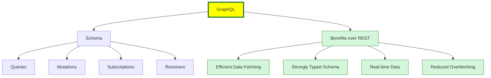
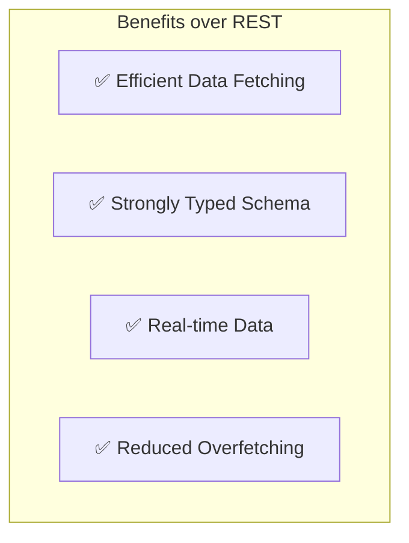

# graphql


# What is GraphQL?

**GraphQL** is a query language for APIs and a runtime for executing those queries with your existing data. It was developed by Facebook in 2012 and released as an open-source project in 2015.

## 🔍 Key Features

- **Declarative Data Fetching**: Clients specify exactly what data they need.
- **Single Endpoint**: Unlike REST, GraphQL APIs typically use a single endpoint.
- **Strongly Typed Schema**: The API is defined by a schema that specifies types and relationships.
- **Real-time Data**: Supports subscriptions for real-time updates.

## 🧱 Core Concepts

- **Schema**: Defines the structure of the API.
- **Types**: Describe the shape of data (e.g., `User`, `Post`).
- **Queries**: Read operations to fetch data.
- **Mutations**: Write operations to modify data.
- **Resolvers**: Functions that resolve a value for a type or field.
- **Subscriptions**: Enable real-time communication via WebSockets.

## 📦 Example Query

```graphql
query {
  user(id: "1") {
    name
    email
  }
}
```





