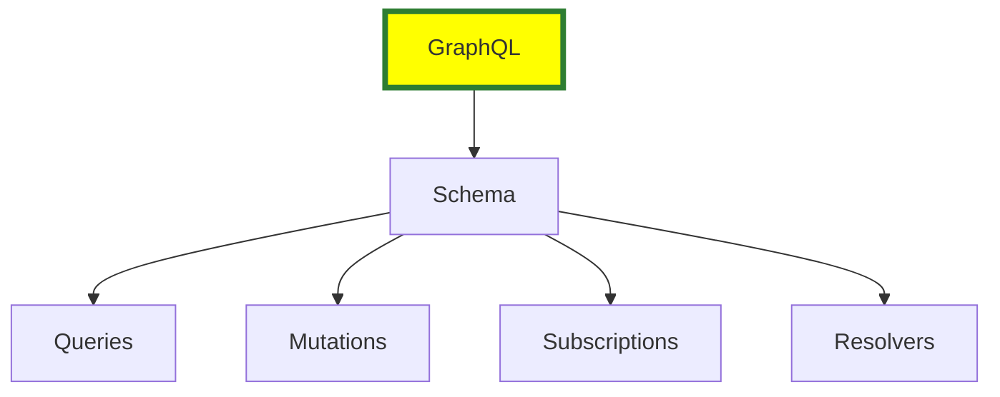
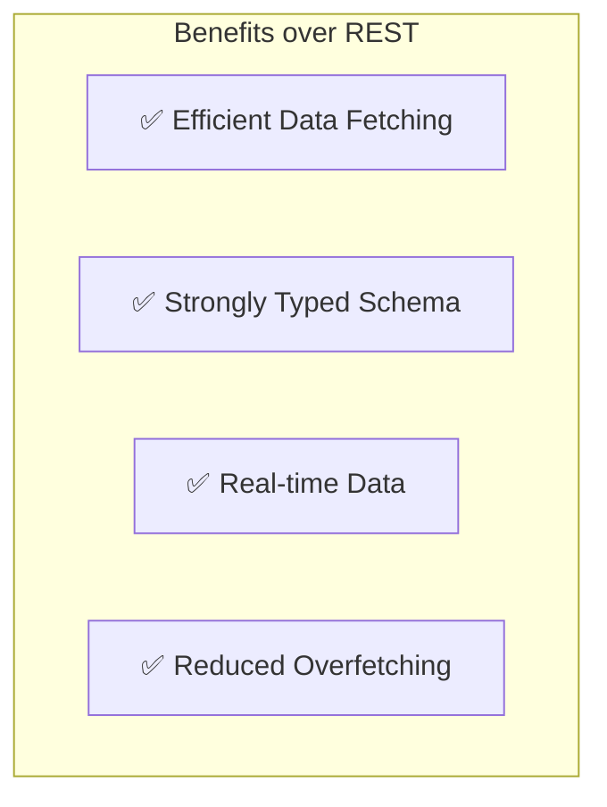

# graphql


# What is GraphQL?

**GraphQL** is a query language for APIs and a runtime for executing those queries with your existing data. It was developed by Facebook in 2012 and released as an open-source project in 2015.

## 🔍 Key Features

- **Declarative Data Fetching**: Clients specify exactly what data they need.
- **Single Endpoint**: Unlike REST, GraphQL APIs typically use a single endpoint.
- **Strongly Typed Schema**: The API is defined by a schema that specifies types and relationships.
- **Real-time Data**: Supports subscriptions for real-time updates.

## 🧱 Core Concepts

- **Schema**: Defines the structure of the API.
- **Types**: Describe the shape of data (e.g., `User`, `Post`).
- **Queries**: Read operations to fetch data.
- **Mutations**: Write operations to modify data.
- **Resolvers**: Functions that resolve a value for a type or field.
- **Subscriptions**: Enable real-time communication via WebSockets.

## 📦 Example Query

```graphql
query {
  user(id: "1") {
    name
    email
  }
}
```







## ✅ Efficient Data Fetching
- **Definition**: The ability to request exactly the data you need in a single query.
- **Focus**: Precision and performance.
- **Example**: Requesting just a user's `name` and `email` without retrieving their entire profile.
- **Why it Matters**: Reduces the number of requests and the size of responses, improving speed and reducing bandwidth usage.

---

## 📉 Reduced Overfetching
- **Definition**: Avoiding the retrieval of unnecessary data.
- **Focus**: Minimizing waste.
- **Example**: In REST, an endpoint like `/users/123` might return the full user object, including fields you don’t need (e.g., `address`, `preferences`, `lastLogin`).
- **Why it Matters**: Prevents clients from receiving and processing data they don’t use, which can slow down apps and waste resources.

---

## 🔒 Strongly Typed Schema
- **Definition**: GraphQL schemas are strongly typed, meaning each field has a specific type.
- **Focus**: Ensuring data consistency and validation.
- **Example**: A schema defines a `User` type with fields like `id`, `name`, and `email`, each with a defined type.
- **Why it Matters**: Helps catch errors early and ensures that clients and servers agree on the data format.

---

## 🔄 Real-time Data
- **Definition**: GraphQL supports real-time data updates via subscriptions.
- **Focus**: Providing live updates to clients.
- **Example**: A subscription to a chat application that pushes new messages to clients in real-time.
- **Why it Matters**: Allows applications to react to changes in data without polling, improving user experience.

